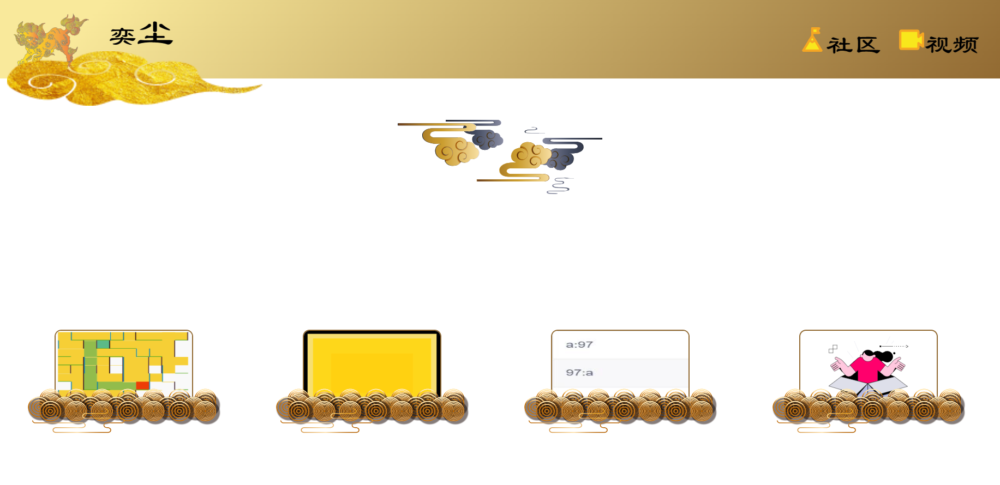

# 作品集
【中文|[英文](./README.en.md)】
#### 介绍
本页面由**奕尘教育**所有，仅供学习，**未经允许禁止商用**。

#### 首页

#### Todo
- 精细化推荐
- 添加详情页面
- 编辑器页面布局修改
- 在线升级服务
- 更丝滑的跨端

#### 使用说明
(待添加)
1.  社区：
2.  Discord:
3.  B站
4.  YoutuBe:
5.  抖音（国内）：
6.  TiTock:
7.  抖音：
8.  快手：
9.  西瓜：
10. 邮件：public@1ccode.com

#### 参与贡献

1.  Fork 本仓库
2.  新建 Feat_xxx 分支
3.  提交代码
4.  新建 Pull Request